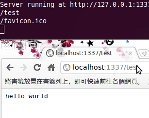
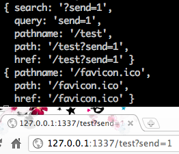
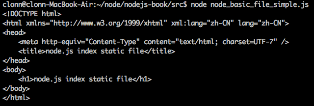

# Node.js 基礎

前篇文章已經由介紹、安裝至設定都有完整介紹，Node.js 基礎
 內部除了 JavaScript 常用的函式(function)、物件(object)之外，也有許多不同的自訂物件，Node.js 預設建立這些物件為核心物件，是為了要讓開發流程更為，這些資料在官方文件已經具有許多具體說明。接下來將會介紹在開發 Node.js 程式時常見的物件特性與使用方法。

## Node.js http 伺服器建立

在 Node.js 官方網站 <http://nodejs.org> 裡面有舉一個最簡單的 HTTP 伺服器建立，一開始初步就是建立一個伺服器平台，讓 Node.js 可以與瀏覽器互相行為。每種語言一開始的程式建立都是以 `Hello world` 開始，最初也從 `Hello world` 帶各位進入 node.js 的世界。

輸入以下程式碼，儲存檔案為 `node_basic_http_hello_world.js` 

```javascript
var server,
    ip   = "127.0.0.1",
    port = 1337,
    http = require('http');

server = http.createServer(function (req, res) {
  res.writeHead(200, {'Content-Type': 'text/plain'});
  res.end('Hello World\n');
});

server.listen(port, ip);

console.log("Server running at http://" + ip + ":" + port);
```

### 程式碼解講

一開始需要有幾個基本的變數。

 * ip: 機器本身的ip 位置，因為使用本地端，因此設定為127.0.0.1
 * port: 需要開通的阜號，通常設定為http port 80，因範例不希望與基本port 相衝，隨意設定為1337

在 Node.js 的程式中，有許多預設的模組可以使用，因此需要使用 `require` 方法將模組引入，在這邊我們需要使用 `http` 這個模組，因此將 `http` 載入。`Http` 模組裡面內建有許多方法可以使用，這邊採用 `createServer` 創建一個基本的 http 伺服器，再將 http 伺服器給予一個 `server` 變數。裡面的回呼函式(call back function) 可以載入 http 伺服器的資料與回應方法(`request`, `response`)。在程式裡面就可以看到我們直接回應給瀏覽器端所需的 Header，回應內容。

```javascript
res.writeHead(200, {'Content-Type': 'text/plain'});
res.end('Hello World\n');
```

Http 伺服器需要設定 `port`, `ip`，在最後需要設定 Http 監聽，需要使用到 `listen` 事件，監聽所有 Http 伺服器行為。

```javascript
http.listen(port, ip);
```

所有事情都完成之後，需要確認伺服器正確執行因此使用 `console`，在 JavaScript 裡就有這個原生物件，`console` 所印出的資料都會顯示於 Node.js 伺服器頁面，這邊印出的資料並不會傳送到使用者頁面上，之後許多除錯(debug) 都會用到 `console` 物件。

```javascript
console.log("Server running at http://" + ip + ":" + port);
```

## Node.js http 路徑建立 

前面已經介紹如何建立一個簡單的 http 伺服器，接下來本章節將會介紹如何處理伺服器路徑(route) 問題。
在 http 的協定下所有從瀏覽器發出的要求(request) 都需要經過處理，路徑上的建立也是如此。

路徑就是指伺服器 ip 位置，或者是網域名稱之後，對於伺服器給予的要求。修改剛才的hello world 檔案，修改如下。

```javascript
server = http.createServer(function (req, res) {
  console.log(req.url);
  res.writeHead(200, {'Content-Type': 'text/plain'});
  res.end('hello world\n');
});
```

重新啟動 Node.js 程式後，在瀏覽器端測試一下路徑行為，結果如下圖，




當在瀏覽器輸入 http://127.0.0.1:1337/test ，在伺服器端會收到兩個要求，一個是我們輸入的 /test 要求，另外一個則是 /favicon.ico。
/test 的路徑要求，http 伺服器本身需要經過程式設定才有辦法回應給瀏覽器端所需要的回應，在伺服器中所有的路徑要求都是需要被解析才有辦法取得資料。
從上面解說可以了解到在 Node.js 當中所有的路徑都需要經過設定，未經過設定的路由會讓瀏覽器無法取得任何資料導致錯誤頁面的發生，底下將會解說如何設定路由，同時避免發生錯誤情形。
先前 Node.js 程式需要增加一些修改，才能讓使用者透過瀏覽器，在不同路徑時有不同的結果。根據剛才的程式做如下的修改，

```javascript
var server,
    ip   = "127.0.0.1",
    port = 1337,
    http = require('http'),
    url = require('url');

server = http.createServer(function (req, res) {
  console.log(req.url);
  res.writeHead(200, {'Content-Type': 'text/plain'});
  res.end('hello world\n');
});

server.listen(port, ip);

console.log('Server running at http://' + ip + ':' + port);
```

程式做了片段的修改，首先載入 `url` 模組，另外增加一個 `path` 變數。
`url` 模組就跟如同他的命名一般，專門處理 url 字串處理，裡面提供了許多方法來解決路徑上的問題。
因為從瀏覽器發出的要求路徑可能會帶有多種需求，或者 GET 參數組合等。因此我們需要將路徑單純化，取用路徑部分的資料即可，例如使用者可能會送出 http://127.0.0.1:1337/test?send=1 ，如果直接信任 **req.url** 就會收到結果為 /test?send=1 ，所以需要透過 `url` 模組的方法將路徑資料過濾。

在這邊使用url.parse 的方法，裡面帶入網址格式資料，會回傳路徑資料。為了後需方便使用，將回傳的資料設定到path 變數當中。在回傳的路徑資料，裡面包含資訊，如下圖，




這邊只需要使用單純的路徑要求，直接取用 `path.pathname` ，就可以達到我們的目的。

最後要做路徑的判別，在不同的路徑可以指定不同的輸出，在範例中有三個可能結果，第一個從瀏覽器輸入 /index 就會顯示 index 結果， /test 就會呈現出 test 頁面，最後如果都不符合預期的輸入會直接顯示 default 的頁面，最後的預防可以讓瀏覽器不會出現非預期結果，讓程式的可靠性提昇，底下為測試結果。


## Node.js 檔案讀取 

前面已經介紹如何使用路由（rount）做出不同的回應，實際應用只有在瀏覽器只有輸出幾個文字資料總是不夠的，在本章節中將介紹如何使用檔案讀取，輸出檔案資料，讓使用者在前端瀏覽器也可以讀取到完整的 HTML, CSS, JavaScript 檔案輸出。

檔案管理最重要的部分就是 **File system** <http://nodejs.org/docs/latest/api/fs.html> 這個模組，此模組可以針對檔案做管理、監控、讀取等行為，裡面有許多預設的方法，底下是檔案輸出的基本範例，底下會有兩個檔案，第一個是靜態 HTML 檔案 `./static/index.html`，


**./static/index.html**
```html
<!DOCTYPE html>
<html xmlns="http://www.w3.org/1999/xhtml" xml:lang="zh-TW" lang="zh-TW">
<head>
    <meta http-equiv="Content-Type" content="text/html; charset=UTF-8" />
    <title>Node.js index html file</title>
</head>
<body>
    <h1>Node.js index html file</h1>
</body>
</html>
```

另一個為 Node.js 程式，

**node_basic_file_simple.js**
```javascript
var fs = require("fs"),
    filename = "static/index.html",
    encode = "utf8";

fs.readFile(filename, encode, function(err, file) {
  console.log(file);
});
```

一開始直接載入 `file system` 模組，載入名稱為 `fs` 。讀取檔案主要使用的方法為 `readFile` ，裡面以三個參數 **路徑(file path)** , **編碼方式(encoding)** ， **回應函式(callback)** ，路徑必須要設定為靜態 HTML 所在位置，才能指定到正確的檔案。靜態檔案的編碼方式也必須正確，這邊使用靜態檔案的編碼為 `utf8` ，如果編碼設定錯誤，Node.js 讀取出來檔案結果會使用 byte raw 格式輸出，如果 **錯誤編碼格式，會導致輸出資料為 byte raw**


**回應函式** 中裡面會使用兩個變數，error 為錯誤資訊，如果讀取的檔案不存在，或者發生錯誤，error 數值會是 true ，如果成功讀取資料 error 將會是 false 。 content 則是檔案內容，資料讀取後將會把資料全數丟到content 這個變數當中。

最後程式的輸出結果畫面如下，




## Node.js http 靜態檔案輸出

前面已經了解如何讀取本地端檔案，接下來將配合 `http` 伺服器路由，讓每個路由都能夠輸出相對應的靜態 HTML 檔案。
首先新增加幾個靜態 HTML 檔案，

**./static/index.html**
```html
<!DOCTYPE html>
<html xmlns="http://www.w3.org/1999/xhtml" xml:lang="zh-TW" lang="zh-TW">
<head>
    <meta http-equiv="Content-Type" content="text/html; charset=UTF-8" />
    <title>node.js index html file</title>
</head>
<body>
    <h1>node.js index html file</h1>
</body>
</html>
```

**./static/test.html**
```html
<!DOCTYPE html>
<html xmlns="http://www.w3.org/1999/xhtml" xml:lang="zh-TW" lang="zh-TW">
<head>
    <meta http-equiv="Content-Type" content="text/html; charset=UTF-8" />
    <title>node.js test html file</title>
</head>
<body>
    <h1>node.js test html file</h1>
</body>
</html>
```

**./static/static.html**
```html
<!DOCTYPE html>
<html xmlns="http://www.w3.org/1999/xhtml" xml:lang="zh-TW" lang="zh-TW">
<head>
    <meta http-equiv="Content-Type" content="text/html; charset=UTF-8" />
    <title>node.js static html file</title>
</head>
<body>
    <h1>node.js static html file</h1>
</body>
</html>
```

準備一個包含基本路由功能的 http 伺服器 

```javascript
var server,
    ip   = '127.0.0.1',
    port = 1337,
    http = require('http'),
    url = require('url');

server = http.createServer(function (req, res) {
    var path = url.parse(req.url);
});

server.listen(port, ip);

console.log('Server running at http://' + ip + ':' + port);
```

加入 `file system` 模組， 使用 `readFile` 的功能，將這一段程式放置於 `createServer` 的回應函式中。

```javascript
fs.readFile(filePath, encode, function(err, file) {
  // something
});
```

readFile 的回應函式裡面加入頁面輸出，讓瀏覽器可以正確讀到檔案，在這邊我們設定讀取的檔案為 html 靜態檔案，所以 Content-type 設定為 **text/html** 。讀取到檔案的內容，將會正確輸出成 html 靜態檔案。

```javascript
fs.readFile(filePath, encode, function(err, file) {
  res.writeHead(200, {'Content-Type': 'text/html'});
  res.write(file);
  res.end();
});
```

到這邊為止基本的程式內容都已經完成，剩下一些細節的調整。首先路徑上必須做調整，目前的靜態檔案全部都放置於 **static 資料夾** 底下，設定一個變數來記住資料夾位置。

接著將瀏覽器發出要求路徑與資料夾組合，讀取正確html 靜態檔案。使用者有可能會輸入錯誤路徑，所以在讀取檔案的時候要加入錯誤處理，同時回應 **404** 伺服器無法正確回應的 http header 格式。

加入這些細節的修改，一個基本的http 靜態 html 輸出伺服器就完成了，完整程式碼如下，

.. literalinclude:: ../src/node_basic_file_http_static.js
   :language: javascript


node.js http GET 資料擷取
========================

http 伺服器中，除了路由之外另一個最常使用的方法就是擷取GET 資料。本單元將會介紹如何透過基本http 伺服器擷取瀏覽器傳來的要求，擷取GET 資料。

在http 協定中，GET 參數都是藉由URL 從瀏覽器發出要求送至伺服器端，基本的傳送網址格式可能如下，

::

    http://127.0.0.1/test?send=1&test=2

上面這段網址，裡面的GET 參數就是 send 而這個變數的數值就為 1，如果想要在http 伺服器取得GET 資料，需要在瀏覽器給予的要求(request)做處理，

首先需要載入 **query string** 這個模組，這個模組主要是用來將字串資料過濾後，轉換成 **javascript 物件**。


.. code-block:: javascript
    
    qs = require('querystring');

接著在第一階段，利用url 模組過濾瀏覽器發出的URL 資料後，將回應的物件裡面的 query 這個變數，是一個字串值，資料過濾後如下，

..

    send=1&test=2

透過 query string ，使用parse 這個方法將資料轉換成javascript 物件，就表示 GET 的資料已經被伺服器端正式擷取下來，

.. code-block:: javascript

    path = url.parse(req.url);      
    parameter = qs.parse(path.query);

整個node.js http GET 參數完整擷取程式碼如下，

.. literalinclude:: ../src/node_basic_http_get.js
   :language: javascript

程式運作之後，由瀏覽器輸入要求網址之後，node.js 伺服器端回應資料為，

::

    Server running at http://127.0.0.1:1337
    { send: '1', test: '1' }


本章結語
=======

前面所解說的部份，一大部分主要是處理 http 伺服器基本問題，雖然在某些部分有牽扯到http 伺服器基本運作原理，主要還是希望可以藉由這些基本範例練習node.js ，練習回應函式與語法串接的特點，習慣編寫javascript 風格程式。當然直接這樣開發node.js 是非常辛苦的，接下來在模組實戰開發的部份將會介紹特定的模組，一步一步帶領各位從無到有進行node.js 應用程式開發。

