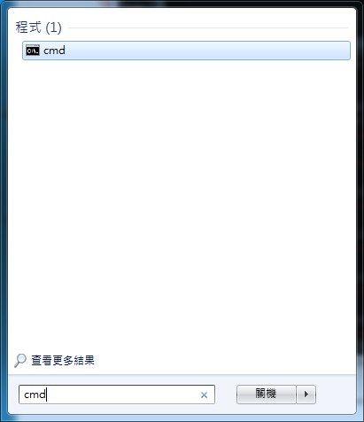
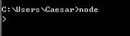

# Windows

nodeJS 在 v0.6.0 版本之後開始正式支援 windows native，直接使用 node.exe 就可以執行程式，支援性完全與 linux 相同，更棒的部份就是不需經過編譯，經過下載之後，簡單設定完成，立即開發 node 程式。

下載node.js 安裝檔案 http://nodejs.org/#download

如此完成 windows native node.exe 安裝，接著可以進入 command line 執行測試。在 command line 輸指令如下

```
node -v
```

接著出現node.js 版本訊息畫面，表示安裝完成。




